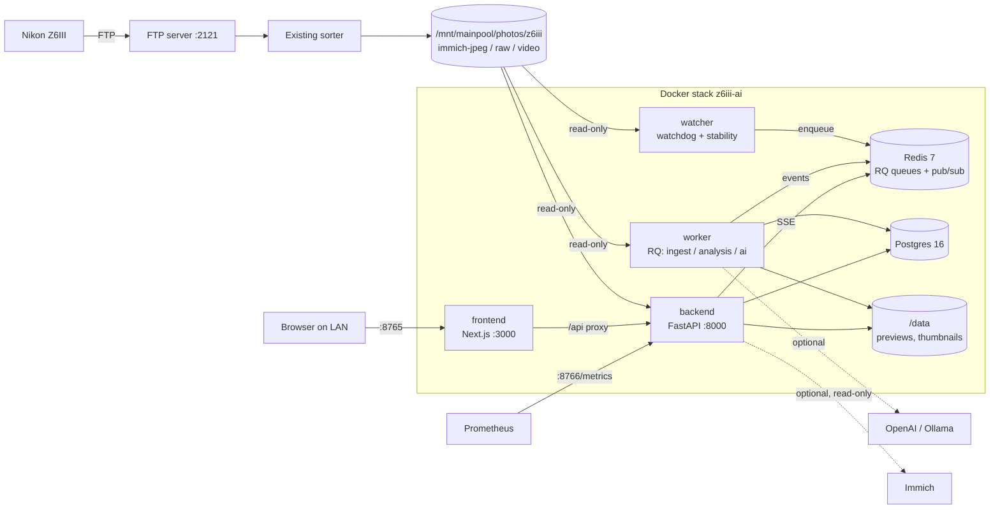

# Z6III AI Studio

[](https://github.com/bhusallaxman22/Camera-Dashboard./actions/workflows/ci.yml)

**Intelligent Nikon photography workflow** — a self-hosted web app for TrueNAS SCALE that
watches the folders your Nikon Z6III uploads into over FTP, pairs every RAW+JPEG capture into a
single photo, reads the full Nikon metadata, renders previews, measures sharpness and exposure,
and gives you a fast dark UI for browsing and culling — live, while you are still shooting.

It sits next to (not in place of) Immich, the FTP sorter and your editors: **originals are
mounted read-only and are never moved, renamed, modified or deleted.** Ratings, flags, tags and
notes live only in the app database.

---

## Contents

- [Features](#features)
- [Architecture](#architecture)
- [Requirements](#requirements)
- [Folder layout](#folder-layout)
- [Installation on TrueNAS SCALE](#installation-on-truenas-scale)
- [Dockge setup](#dockge-setup)
- [`.env` configuration](#env-configuration)
- [Docker / Make commands](#docker--make-commands)
- [Migrations](#migrations)
- [Initial scan](#initial-scan)
- [Logs](#logs)
- [Using the app](#using-the-app)
- [API docs](#api-docs)
- [Prometheus & Grafana](#prometheus--grafana)
- [AI providers](#ai-providers)
- [Immich integration](#immich-integration)
- [Remote access & security](#remote-access--security)
- [Backup recommendations](#backup-recommendations)
- [Troubleshooting](#troubleshooting)
- [How it works (design decisions)](#how-it-works-design-decisions)
- [Development](#development)
- [Roadmap](#roadmap)

---

## Features

| Area             | What you get                                                                                                                                                                       |
| ---------------- | ---------------------------------------------------------------------------------------------------------------------------------------------------------------------------------- |
| Live ingest      | Recursive watcher (inotify, automatic polling fallback) with file-stability checks, debounce, retries, a startup reconcile and a periodic safety-net scan.                          |
| RAW+JPEG pairing | `DSC_1234.NEF` + `DSC_1234.JPG` become **one** photo regardless of arrival order, duplicates, counter rollover or a second camera body (see [pairing](#pairing)).                   |
| Metadata         | ExifTool 13.59 with full Nikon maker notes: lens, AF mode/area/points, shutter count, Picture Control, VR, subject detection, focus distance… Unknown tags are kept in JSONB.       |
| Renditions       | 2560 px JPEG preview + 256/512/1024 px WebP thumbnails, written only under `/data`. High-Efficiency NEFs use the camera's embedded full-size preview.                              |
| Analysis         | Sharpness (Laplacian variance on a normalised crop), brightness, highlight/shadow clipping, RGB + luma histograms, dominant colours, YuNet face + eye detection with per-face sharpness. |
| AI critique      | Pluggable providers: built-in local heuristic critique (default, offline), OpenAI-compatible vision models, or Ollama on your own GPU.                                              |
| Culling          | 0–5 stars, pick/reject, favourite, needs-edit, exported, tags and notes — with keyboard shortcuts. Stored in Postgres only, never in the files.                                     |
| Library          | Infinite grid, URL-synced filters (date, camera, lens, ISO, focal length, sharpness, faces, files, scene, tags, ratings, flags), burst collapsing, Postgres full-text search.       |
| Bursts           | Consecutive frames from the same camera/focal length within 1 s are grouped and shown as “frame 2/5”.                                                                              |
| Dashboard        | Camera status (receiving/idle), today's stats, latest capture with exposure strip and analysis, recent grid, activity feed — all updated live over SSE.                            |
| Editor workflow  | Per-file NAS path and SMB path with one-click copy, JPEG/RAW/video downloads (validated to stay inside the photo roots).                                                           |
| Operations       | `/health`, `/metrics` (Prometheus), structured JSON logs, a System page with queues/workers/storage/jobs/event log, retry for failed jobs, CLI for scans and maintenance.          |

## Architecture



| Service    | Image                         | Role                                                                                                    | Published        |
| ---------- | ----------------------------- | ------------------------------------------------------------------------------------------------------- | ---------------- |
| `postgres` | `postgres:16-alpine`          | App state (photos, files, analysis, culling, jobs, events).                                             | no               |
| `redis`    | `redis:7-alpine`              | RQ job queues, live-event pub/sub, worker-side metrics. AOF persistence.                                | no               |
| `backend`  | `z6iii-ai-backend:local`      | REST API, SSE stream, downloads, `/health`, `/metrics`. Runs migrations on start.                       | `8766:8000`      |
| `worker`   | same image                    | Ingest (ExifTool, pairing, renditions), technical analysis, AI critique. Scale with more replicas.      | no               |
| `watcher`  | same image                    | Watches the photo roots, waits for files to be stable, enqueues ingest; startup + periodic reconcile.   | no               |
| `frontend` | `z6iii-ai-frontend:local`     | Next.js UI. Proxies `/api/*` to the backend over the Docker network (the browser never needs its URL). | `8765:3000`      |

**Pipeline for a new capture:** sorter moves `DSC_1234.JPG` into `immich-jpeg/2026/10/01/` →
watcher sees it, waits until size+mtime are stable for `FILE_STABLE_SECONDS` → `ingest_file`
job: ExifTool → pairing → Photo/PhotoFile rows → `photo.created` event → `render` (preview +
thumbnails) → `analyze` (technical metrics, faces) → `ai_critique` → `photo.analyzed` event. The
NEF arriving later (or earlier) attaches to the same photo. Every step is idempotent and retried
with back-off (5 s, 30 s, 120 s).

## Requirements

- TrueNAS SCALE 24.10+ (tested target: **25.04.2.5**) with the built-in Docker engine, or any Linux host with Docker Engine 24+ and Compose v2.
- A couple of GB of free RAM and 2+ CPU cores (the 3900X / 64 GB box is far more than enough).
- The FTP sorter already placing files into `immich-jpeg/`, `raw/` and `video/` under one dataset.
- Optional: an OpenAI-compatible API key, or Ollama with a vision model (the RTX 3060 / Tesla P40 work well).

No GPU is required for the app itself; the GPU only matters if you run Ollama.

## Folder layout

```text
z6iii-ai/                      # e.g. /mnt/mainpool/configs/z6iii-ai
├── compose.yaml               # Dockge / docker compose stack
├── .env.example               # copy to .env (never commit .env)
├── Makefile                   # make help
├── backend/                   # FastAPI + RQ worker + watcher (one image)
│   ├── Dockerfile
│   ├── requirements.txt / requirements-dev.txt
│   ├── alembic.ini, migrations/
│   ├── app/
│   │   ├── main.py, config.py, database.py, cli.py, log.py
│   │   ├── api/          REST routes, SSE
│   │   ├── models/       SQLAlchemy 2 models
│   │   ├── schemas/      Pydantic models
│   │   ├── services/     ingest, pairing, scanner, bursts, sessions, stats, immich…
│   │   ├── workers/      RQ queues, tasks, worker entrypoint
│   │   ├── watchers/     watchdog observer + stability tracker
│   │   ├── metadata/     ExifTool wrapper + Nikon parser
│   │   ├── image/        loaders, renditions, technical analysis
│   │   ├── ai/           provider interface, local/OpenAI/Ollama providers
│   │   ├── observability/ Prometheus collector
│   │   └── utils/        path safety, hashing, time, formatting, sample generator
│   └── tests/            pytest suite
├── frontend/                  # Next.js 16 / React 19 / Tailwind 4
│   ├── Dockerfile
│   └── src/{app,components,lib,test}
└── data/                      # generated only (bind-mounted as /data)
    ├── thumbnails/  previews/  cache/
    ├── postgres/               # Postgres data directory
    └── redis/                  # Redis AOF
```

Photo dataset (read-only to the app), as produced by the sorter:

```text
/mnt/mainpool/photos/z6iii/
├── ftp-incoming/   # FTP landing zone — ignored by the app (the sorter owns it)
├── immich-jpeg/YYYY/MM/DD/DSC_1234.JPG
├── raw/YYYY/MM/DD/DSC_1234.NEF
├── video/YYYY/MM/DD/DSC_1235.MOV
└── unsorted/       # ignored
```

## Installation on TrueNAS SCALE

These steps assume the project lives at **`/mnt/mainpool/configs/z6iii-ai`** and the photos at
**`/mnt/mainpool/photos/z6iii`**. Run them in a TrueNAS shell (System → Shell, or SSH) as an
admin user; prefix `docker` commands with `sudo` if your user isn't in the `docker` group.

1. **Create a dataset for app config/data** (UI: Datasets → `mainpool` → Add Dataset → `configs/z6iii-ai`,
   preset *Apps* or *Generic*). Using a dataset (not a plain folder) lets you snapshot it.

2. **Copy the project into it**

   ```bash
   cd /mnt/mainpool/configs
   git clone <your-repo-url> z6iii-ai      # or copy the folder over SMB/scp
   cd z6iii-ai
   ```

3. **Create the data folders and give the app user ownership**

   The app containers run as UID/GID **568** (TrueNAS `apps`) by default (`PUID`/`PGID`).

   ```bash
   mkdir -p data/thumbnails data/previews data/cache data/postgres data/redis
   sudo chown -R 568:568 data/thumbnails data/previews data/cache
   ```

   Postgres and Redis fix ownership of their own folders on first start.

4. **Make sure UID 568 can read the photos** (it never needs write access):

   ```bash
   sudo -u apps ls /mnt/mainpool/photos/z6iii/raw | head
   ```

   If that fails, add a *read/execute* ACL entry for the `apps` user (or group) on the
   `photos/z6iii` dataset in Datasets → Permissions, applied recursively. Alternatively set
   `PUID`/`PGID` to a user that already has read access (e.g. the Immich user).

5. **Configure**

   ```bash
   cp .env.example .env
   openssl rand -hex 24        # paste as POSTGRES_PASSWORD
   nano .env                   # check PHOTO_HOST_ROOT, APP_DATA_DIR, TZ, SMB_PHOTO_ROOT
   ```

6. **Build and start**

   ```bash
   sudo docker compose up -d --build     # or: make up
   sudo docker compose ps                # all services should become "healthy"
   ```

   The first build downloads ExifTool and the YuNet face model and takes a few minutes.

7. **Open the app**: <http://192.168.0.142:8765> (API docs: <http://192.168.0.142:8766/docs>).
   Existing photos are imported automatically (see [Initial scan](#initial-scan)); new
   captures appear on the dashboard within a few seconds of the sorter placing them.

8. **Verify** — System page shows every component *Healthy*, and:

   ```bash
   curl -s http://192.168.0.142:8766/health | python3 -m json.tool
   ```

**Updating:** `git pull && sudo docker compose up -d --build` (migrations run automatically).

## Dockge setup

Dockge manages stacks that live in its *stacks directory* (`<stacks>/<name>/compose.yaml`) and
supports `build:` sections, so the stack works unchanged:

- **If Dockge's stacks directory is `/mnt/mainpool/configs`**, the stack `z6iii-ai` appears
  automatically (click *Scan Stacks Folder* if not). Open it → *Start*.
- **If Dockge uses a different stacks directory** (e.g. `/mnt/mainpool/dockge/stacks`), clone
  the project there instead (`…/stacks/z6iii-ai`) and keep `APP_DATA_DIR` pointing at your data
  dataset, or create the stack in Dockge and paste `compose.yaml` + `.env` — the `build:`
  contexts are relative, so the `backend/` and `frontend/` folders must sit next to `compose.yaml`.

Edit the `.env` in Dockge's *.env* editor, then *Update* (rebuilds images) or *Restart*.
Healthchecks show up as the green/red state of each container.

## `.env` configuration

All settings are environment variables; `.env.example` documents every one. The important ones:

| Variable | Default | Meaning |
| --- | --- | --- |
| `PHOTO_HOST_ROOT` | `/mnt/mainpool/photos/z6iii` | Host photo dataset, mounted **read-only** at `/photos`. |
| `APP_DATA_DIR` | `/mnt/mainpool/configs/z6iii-ai/data` | Host folder for generated data, Postgres and Redis. |
| `PUID` / `PGID` | `568` | User the backend/worker/watcher run as. Needs read on photos, write on `APP_DATA_DIR`. |
| `FRONTEND_PORT` / `BACKEND_PORT` | `8765` / `8766` | Published LAN ports. Postgres and Redis are never published. |
| `POSTGRES_PASSWORD` | — | **Required.** Long random string. |
| `TZ` | `America/Chicago` | Used for "today" stats and the sorter's folder dates. Stored timestamps are UTC. |
| `NAS_PHOTO_ROOT` | `/mnt/mainpool/photos/z6iii` | How `/photos/...` paths are displayed/copied. |
| `SMB_PHOTO_ROOT` | empty | Optional SMB share for “copy SMB path”, e.g. `\\truenas\photos\z6iii`, `192.168.0.142\Z6III_Photos` or `smb://truenas/photos`. |
| `WATCH_MODE` | `auto` | `auto` (inotify, fall back to polling), `inotify`, or `polling`. |
| `FILE_STABLE_SECONDS` | `3` | A file must keep the same size+mtime this long before it is ingested. |
| `SCAN_ON_STARTUP` / `RECONCILE_INTERVAL_MINUTES` | `true` / `30` | Startup reconcile and safety-net full scan (`0` disables the periodic one). |
| `PAIR_WINDOW_SECONDS` | `2` | Max capture-time difference for a JPEG and NEF with the same name to pair. |
| `BURST_MAX_GAP_SECONDS` | `1.0` | Max gap between frames of a burst. |
| `INGEST_SESSION_GAP_MINUTES` / `CAMERA_ONLINE_MINUTES` | `20` / `5` | Upload-session grouping; how long the camera shows as “receiving”. |
| `PREVIEW_MAX_EDGE`, `THUMBNAIL_SIZES` | `2560`, `256,512,1024` | Rendition sizes (change + `make rebuild-thumbnails ARGS=--all`). |
| `AI_PROVIDER` | `local` | `local`, `openai`, `ollama` or `none`. See [AI providers](#ai-providers). |
| `IMMICH_ENABLED` | `false` | Read-only Immich lookups/links. |
| `API_TOKEN` | empty | Optional bearer token for `/api/v1`; the frontend proxy injects it automatically. |
| `LOG_FORMAT` / `LOG_LEVEL` | `json` / `INFO` | `console` is easier to read by eye. |

Advanced (not in `.env.example`, defaults are fine): `JOB_TIMEOUT_SECONDS=600`,
`JOB_MAX_RETRIES=3`, `WATCH_POLL_INTERVAL_SECONDS=2`, `BURST_FOCAL_TOLERANCE=0.05`.

## Docker / Make commands

`make help` lists everything. Common ones (each wraps `docker compose`):

| Make | Raw command | Purpose |
| --- | --- | --- |
| `make up` | `docker compose up -d --build` | Build + start / update. |
| `make down` | `docker compose down` | Stop (data is kept). |
| `make ps` | `docker compose ps` | Status + health. |
| `make logs` / `make logs-worker` | `docker compose logs -f --tail=200 [svc]` | Follow logs. |
| `make restart` | `docker compose restart backend worker watcher frontend` | Restart app containers. |
| `make health` | `curl localhost:8000/health` in the backend | Component health JSON. |
| `make scan` | `docker compose exec backend python -m app.cli scan` | Queue a reconcile of all files. |
| `make verify-files` | `… app.cli verify-files` | Mark missing/restored originals (never deletes). |
| `make rebuild-thumbnails ARGS=--all` | `… app.cli rebuild-thumbnails --all` | Regenerate renditions. |
| `make reanalyze ARGS=--ai` | `… app.cli reanalyze --ai` | Re-run analysis (+ AI critique). |
| `make stats` | `… app.cli stats` | Library statistics. |
| `make backup-db` | `pg_dump -Fc` into `./backups/` | Database backup. |
| `make psql` / `make shell` | | Database / container shell. |

Scale workers for big imports: `docker compose up -d --scale worker=3` (remove
`container_name` from the `worker` service first, since scaled containers need unique names).

## Migrations

The backend container runs `alembic upgrade head` on every start, so a fresh install and every
update apply migrations automatically. To run them by hand:

```bash
make migrate                                  # docker compose exec backend alembic upgrade head
docker compose exec backend alembic current   # show the applied revision
```

## Initial scan

With `SCAN_ON_STARTUP=true` (default) the watcher queues a full scan of `immich-jpeg/`, `raw/` and
`video/` when it starts. It is **idempotent**: unchanged files (same path, size and mtime) are
skipped, so re-running it never creates duplicates. Files modified within the last
`FILE_STABLE_SECONDS` are left for the live watcher.

- Progress: System page → *Pipeline* / *Jobs*, or `make logs-worker`.
- Manual: *Rescan library* on the System page, `make scan`, or `make scan ARGS=--inline` to run
  in the foreground.
- Speed: in testing a 45 MP RAW+JPEG pair took about 1 s of worker time in total (ExifTool,
  2560 px preview, thumbnails, analysis). A large back-catalogue is limited by disk and CPU —
  add workers (see below) to import faster.
- `make scan ARGS=--force` re-reads metadata for every file (e.g. after an ExifTool upgrade).

Backfilled photos don't count as camera activity — the dashboard's camera card only reflects
files the live watcher sees arriving.

## Logs

All services log to stdout (Docker json-file driver, rotated at 5 × 10 MB per container).
`LOG_FORMAT=json` emits one JSON object per line with `event`, `level`, `category`
(`INGEST`, `PAIR`, `RENDER`, `ANALYSIS`, `AI`, `WATCH`, `API`, `ERROR`…) and context such as
`path`, `photo_id`, `pair_reason`, `duration_ms`. Important events are also stored in Postgres
and shown in the System page's *Event log* and the dashboard's *Activity* feed.

```bash
make logs-watcher                                   # what the watcher sees
docker compose logs worker | grep '"category": "PAIR"'
```

## Using the app

| Page | Highlights |
| --- | --- |
| **Dashboard** `/` | Camera status, today's counts, the latest capture (large preview, exposure strip, histogram, sharpness/clipping, culling buttons, NAS/SMB paths, downloads, AI critique), recent captures, live activity. A toast appears for each new photo. |
| **Library** `/library` | Filters are kept in the URL (bookmarkable). Density toggle, *Collapse bursts*, sort by date/rating/sharpness/filename/import time, full-text search across filename, camera, lens, scene, tags, notes and AI text. |
| **Photo** `/photos/{id}` | Zoomable viewer (wheel, double-click, drag, 1:1, fullscreen) with face/eye overlay, burst strip, tabs for Info / Analysis / AI / Files. |
| **System** `/system` | Component health, queues, workers, storage and mount read-only status, configuration, jobs (filter + retry), event log, rescan/verify buttons. |

Keyboard shortcuts on the photo page: **0–5** rating, **P** pick, **X** reject, **U** unflag,
**F** favourite, **E** needs edit, **← / →** previous/next, **Esc** back to library.

Analysis wording is deliberately hedged (“likely”, “estimated”): metrics are measured on the
JPEG rendering and are guidance, not ground truth.

## API docs

Interactive OpenAPI docs: **<http://192.168.0.142:8766/docs>** (ReDoc at `/redoc`, schema at
`/openapi.json`). All app routes live under `/api/v1`:

| Method & path | Purpose |
| --- | --- |
| `GET /health`, `GET /health/live` | Component health (200/503) and liveness. |
| `GET /metrics` | Prometheus metrics. |
| `GET /api/v1/photos` | List with filters, `sort`, `page`, `page_size`. |
| `GET /api/v1/photos/facets` | Cameras, lenses, scenes, tags and ranges for filter UIs. |
| `GET /api/v1/photos/{id}` | Detail: files, metadata, analysis, critique, burst, neighbours. |
| `PATCH /api/v1/photos/{id}` | Rating, flag, favourite, needs_edit, exported, notes, tags. |
| `POST /api/v1/photos/bulk` | Apply the same change to many photos. |
| `POST /api/v1/photos/{id}/analyze` | Queue technical analysis and/or AI critique. |
| `GET /api/v1/photos/{id}/thumbnail?size=512`, `/preview` | Renditions (served from `/data`). |
| `GET /api/v1/files/{file_id}/download` | Original file download (validated against the photo roots). |
| `GET /api/v1/search?q=` | Full-text search. |
| `GET/POST /api/v1/albums`, `GET/POST /api/v1/tags` | Albums and tags. |
| `GET /api/v1/stats` | Dashboard statistics + camera status. |
| `GET /api/v1/system` | Health, queues, workers, storage, configuration. |
| `POST /api/v1/system/rescan`, `/system/verify` | Queue a rescan / file verification. |
| `GET /api/v1/jobs`, `POST /api/v1/jobs/{id}/retry`, `POST /api/v1/jobs/retry-failed` | Job history and retries. |
| `GET /api/v1/events`, `GET /api/v1/events/stream` | Event log and the SSE stream. |

SSE messages are JSON `{"type", "ts", "data"}` with types `photo.created`, `photo.updated`,
`photo.analyzed`, `job.updated` and `system.event`.

```bash
curl -s 'http://192.168.0.142:8766/api/v1/photos?rating_min=4&flag=pick&page_size=10'
curl -s -X PATCH http://192.168.0.142:8766/api/v1/photos/<id> \
     -H 'content-type: application/json' -d '{"rating": 5, "favorite": true}'
curl -sN http://192.168.0.142:8765/api/v1/events/stream     # live events via the frontend
```

## Prometheus & Grafana

Add a scrape job to your existing Prometheus:

```yaml
scrape_configs:
  - job_name: z6iii-ai
    metrics_path: /metrics
    static_configs:
      - targets: ["192.168.0.142:8766"]
```

| Metric | Type | Notes |
| --- | --- | --- |
| `z6iii_photos_total`, `z6iii_raw_files_total`, `z6iii_jpeg_files_total`, `z6iii_video_files_total` | gauge | Library size (from Postgres at scrape time). |
| `z6iii_last_ingest_timestamp` | gauge | Unix time of the last ingested file — alert if stale while shooting. |
| `z6iii_queue_depth{queue}`, `z6iii_queue_failed{queue}` | gauge | RQ backlog and failed registry. |
| `z6iii_workers`, `z6iii_watcher_up` | gauge | Live workers (by heartbeat) and watcher heartbeat. |
| `z6iii_ingest_jobs_total{status}`, `z6iii_ingest_failures_total`, `z6iii_analysis_runs_total`, `z6iii_ai_runs_total{provider,status}` | counter | Accumulated across containers via Redis. |
| `z6iii_ingest_seconds`, `z6iii_thumbnail_generation_seconds`, `z6iii_analysis_seconds`, `z6iii_ai_seconds` | histogram | Pipeline stage durations. |
| `z6iii_http_requests_total{method,route,status}`, `z6iii_http_request_seconds{route}` | counter / histogram | API traffic. |

Useful alerts: `z6iii_workers == 0`, `z6iii_watcher_up == 0`, `z6iii_queue_failed > 0`,
`rate(z6iii_ingest_failures_total[15m]) > 0`.

## AI providers

Every provider implements one interface:

```python
class AIProvider(ABC):
    def analyze_photo(self, photo: PhotoContext, preview: Path) -> AIResult: ...
```

`PhotoContext` carries the EXIF summary and the measured technical metrics; `preview` is the
2560 px JPEG (downscaled to 1024 px before upload). Results — scene, subject, description,
composition/technical notes, issues, suggestions, tags, an aesthetic estimate and confidence —
are stored per run, so you can compare providers. Failures are recorded and never block ingest.

| `AI_PROVIDER` | Setup | Notes |
| --- | --- | --- |
| `local` (default) | nothing | Offline heuristic critique from EXIF + measurements (exposure advice in ⅓ EV, shutter/handholding hints, face sharpness, clipping). Instant. |
| `ollama` | `OLLAMA_URL=http://192.168.0.142:11434`, `OLLAMA_MODEL=qwen2.5vl:7b` | Runs on your own GPU; nothing leaves the LAN. `ollama pull qwen2.5vl:7b` first. Structured JSON output. |
| `openai` | `OPENAI_API_KEY=…`, optional `OPENAI_MODEL`, `OPENAI_BASE_URL` | Any OpenAI-compatible endpoint with vision + JSON-schema output (OpenAI, a LiteLLM/Ollama `/v1` gateway…). Sends a 1024 px preview. |
| `none` | | Technical analysis only. |

`AI_AUTO_ANALYZE=false` stops automatic critiques; you can still run them per photo
(*Re-analyze* on the photo page) or in bulk with `make reanalyze ARGS=--ai`. Adding a provider means one class in
`backend/app/ai/` plus a line in `registry.py`.

## Immich integration

Optional and **read-only** — the app never writes to Immich, and startup never depends on it.

If Immich imports the same `immich-jpeg` folder as an external library, enable lookups:

```dotenv
IMMICH_ENABLED=true
IMMICH_URL=http://192.168.0.142:2283          # reachable from the backend container
IMMICH_PUBLIC_URL=https://photos.example.com  # what your browser opens (optional)
IMMICH_API_KEY=<read-only key>                # Immich → Account Settings → API Keys
```

The photo page then offers *Find in Immich*, which matches the JPEG by filename and capture time
and stores the asset id so the *Open in Immich* link works. The System page shows whether Immich
is reachable.

## Remote access & security

- Postgres and Redis are only on the internal Docker network; only ports 8765 and 8766 are published.
- The photo dataset is mounted `:ro`. The System page shows a **writable** warning badge for any
  root that the container could write to (expect “read-only” in production).
- All file access goes through database ids; paths are re-validated against the configured roots
  (no `..`, no symlink escapes, no NUL bytes) before anything is served. The frontend proxy only
  forwards `/api/v1/*`.
- There is **no user login** in the MVP — it is designed for a trusted LAN. If you publish it
  through your **Cloudflare Tunnel**, put **Cloudflare Access** (or another identity-aware proxy)
  in front of the frontend hostname and set `API_TOKEN` so the backend port rejects
  unauthenticated calls. Don't publish 8766 through the tunnel at all; Prometheus can scrape it on the LAN.
- Secrets live only in `.env` (git-ignored).

## Backup recommendations

| What | How | Why |
| --- | --- | --- |
| Originals | Your existing ZFS snapshots/replication of `photos/z6iii` | The app never touches them, but they're the only irreplaceable data. |
| Database | `make backup-db` (nightly via a TrueNAS *Cron Job*: `cd /mnt/mainpool/configs/z6iii-ai && make backup-db`) | Ratings, flags, tags, notes, AI critiques. Small (MBs). |
| App dataset | Periodic ZFS snapshot task on `configs/z6iii-ai` | Includes `.env`, DB dumps, Postgres files. Stop the stack or rely on dumps for a consistent DB copy. |
| Thumbnails/previews | Optional — `make rebuild-thumbnails ARGS=--all` regenerates them | Pure cache. |
| Redis | Not needed | Only transient queues/events. |

Restore: `make restore-db FILE=backups/z6iii-YYYYMMDD-HHMMSS.dump`.

## Troubleshooting

| Symptom | Check / fix |
| --- | --- |
| New photos don't appear | System page → *File watcher* healthy? `make logs-watcher`. On some mounts inotify misses events: set `WATCH_MODE=polling`. The 30-minute reconcile catches anything missed; *Rescan library* forces it now. |
| `Permission denied` reading photos | UID `PUID` lacks read/execute on the dataset (step 4 of installation). |
| `Permission denied` under `/data` | `sudo chown -R 568:568 data/thumbnails data/previews data/cache` (or your `PUID`). |
| Postgres won't start: “wrong ownership” / `chmod` errors | The dataset's ACL mode blocks `chown`. Use a dataset with POSIX ACLs (*Generic* preset) for `configs/z6iii-ai`, or a Docker named volume for Postgres. |
| JPEG and NEF show as two photos | Check camera clocks and the worker log's `pair_reason` (e.g. `time_mismatch:3.4s`). Raise `PAIR_WINDOW_SECONDS` if the camera writes them further apart. Different bodies with the same filename are kept apart on purpose. |
| Workers: “no live workers” | `make logs-worker`. A worker is live only if its heartbeat is < 120 s old. |
| Jobs stuck or marked **lost** | Happens if Redis or a worker was killed mid-job. The watcher reaps orphans every 5 min; use *Retry* / *Retry failed* on the System page. |
| Dashboard says *Offline* | The SSE stream is reconnecting. Behind a reverse proxy, disable buffering/compression for `/api/v1/events/stream`. |
| NEF-only photo has no thumbnail | The embedded preview could not be extracted — check ExifTool output with `docker compose exec backend exiftool -a -G1 /photos/raw/...NEF`. |
| “Today” stats look off by hours | Set `TZ` to your local zone. Stored times are UTC; capture time keeps the camera's offset. |
| Port 8765/8766 already used | Change `FRONTEND_PORT` / `BACKEND_PORT` in `.env`. |
| `docker stop` slow | The API caps graceful shutdown at 5 s because SSE streams stay open. |

## How it works (design decisions)

<a id="pairing"></a>**Pairing.** Filename alone is not trustworthy: the Nikon counter wraps at
9999 and a second body reuses names. A file joins an existing photo with the same base name only
if camera serial/model agree, shutter counts match (when both known), capture times are within
`PAIR_WINDOW_SECONDS` (or, if one side lacks EXIF, the sorter's `YYYY/MM/DD` folder and file
mtimes agree), and the photo has a free slot (one display file + one RAW). Pairing takes a
Postgres advisory lock per base name, so a JPEG and NEF processed simultaneously by two workers
cannot create two photos. Exact byte-duplicates are recorded as duplicate files, not new photos.

**Never touching originals.** The mount is `:ro`; the code also never opens originals for
writing. Ratings are not written to XMP/EXIF (planned as an explicit opt-in sidecar export).
Missing files are flagged, not deleted; if a file returns it is marked restored.

**Renditions.** High-Efficiency NEFs (Z6III/Z8 “HE/HE★” compression) can't be decoded by the
bundled rawpy/LibRaw, so RAW-only photos use the full-size JPEG the camera embeds in every NEF
(extracted with ExifTool); rawpy is only a fallback for other NEF types. When a JPEG exists it is the rendering source. Renditions carry a
settings fingerprint so changing sizes/quality marks them stale.

**Queue: RQ on Redis.** Simple, inspectable, good enough for a single-host NAS. Job rows in
Postgres mirror RQ jobs for history and retries; dedupe keys prevent duplicate work. Worker
liveness is judged by heartbeat age (crashed workers otherwise linger as registered). Job rows
whose RQ job vanished (Redis flush, worker SIGKILL between pop and start) are reaped as
*lost* and can be retried, and never block re-queuing.

**Watcher.** inotify where available, polling fallback. A file is processed only after its
size+mtime are unchanged for `FILE_STABLE_SECONDS` (FTP uploads arrive in chunks); partial
files (`.part`, `.filepart`, dotfiles, `._*`) are ignored. `ftp-incoming/` and `unsorted/` are
not watched, so the sorter is never raced.

**Faces.** OpenCV's YuNet (MIT, 230 KB) gives face boxes and eye landmarks quickly on CPU;
per-face sharpness tells you whether the eyes are likely in focus.

**Time.** All timestamps are stored as UTC (`timestamptz`); the camera's UTC offset is kept for
display. Library dates use `TZ`.

**Untrusted metadata.** EXIF and AI text are untrusted: bounded columns are truncated at the ORM
layer, full raw tags are kept in JSONB, and nothing from metadata is ever used as a path.

**Previous/next** on the photo page walk the whole library newest-first (not the current
filter) — simple and predictable for culling a shoot.

## Development

```bash
make dev-install            # backend/.venv + frontend node_modules (Python 3.12, Node 22+)
make check                  # ruff, eslint, prettier, tsc, pytest, vitest, next build
```

- Backend tests run on SQLite + fakeredis by default — no services needed. Set
  `TEST_DATABASE_URL=postgresql+psycopg://…/z6iii_test` to run the same suite on Postgres.
  The pipeline tests need `exiftool` on `PATH` (or `EXIFTOOL_PATH`).
- Run the API locally: `cd backend && DATABASE_URL=… REDIS_URL=… .venv/bin/uvicorn app.main:app --reload`,
  plus `python -m app.workers.run ingest analysis ai` and `python -m app.watchers.run`.
- Run the UI: `cd frontend && BACKEND_INTERNAL_URL=http://127.0.0.1:8000 npm run dev`.
- Demo data: `make samples` writes synthetic Nikon-style JPEG+NEF captures (with bursts) to
  `./samples`; point `PHOTO_ROOT`/`JPEG_ROOT`/`RAW_ROOT` at a copy. Never at the real library.
- Schema changes: edit models, then `alembic revision --autogenerate -m "…"` and review the file.

## Roadmap

**Phase 2 — AI photography critique.** Portrait-aware critique (subject/eye sharpness, face vs
background exposure, separation), suggested next-shot settings, provider comparison, GPU-backed
Ollama by default on the Tesla P40.

**Phase 3 — Smarter library.** Best-of-burst ranking, duplicate and near-duplicate detection,
CLIP-style semantic search, natural-language queries (“portraits at f/1.4”, “clipped
highlights”, “sharpest from yesterday”, “50 mm shots”), opt-in XMP sidecar export of ratings.

**Phase 4 — Camera connectivity (research only).** Evaluate officially supported paths —
Nikon tethering/SDK, PTP over USB or network, NX Tether interoperability — for an eventual
“apply suggested settings to camera” action. **No firmware modification will ever be part of
this project.**
